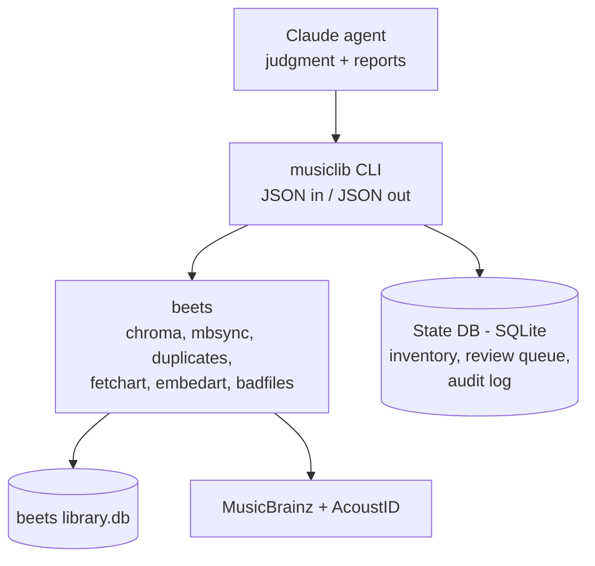
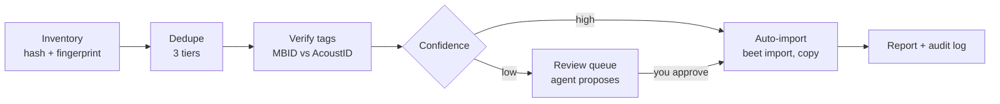

<!--
Synced copy of the living spec doc:
https://claude.ai/code/artifact/100be31d-9e99-440a-8f47-25fef6b76e95
Discussion and edits happen in the doc; re-sync this file after changes.
Last synced: 2026-09-28 (doc rev 62)
-->

# Music Library Agent — Spec

## Overview

The goal is a single clean, MusicBrainz-tagged, de-duplicated library built from years of unsorted dumps, plus a repeatable way to add new folders to it.

**The problem:** one flat directory holds years of mp3, flac and wav folders. Nothing is sorted, duplicates are likely, and some MusicBrainz tags are probably wrong.

**Goals**

- Build one organized library with consistent folders and filenames.
- Verify MusicBrainz tags against acoustic fingerprints, not just against the existing tags.
- Find duplicates and keep the best copy of each by an explicit policy.
- Ingest a new folder in one step, with the same checks as the first cleanup.
- Log every action so any decision can be traced and undone.

**Non-goals (for now)**

- Playback, streaming or a UI. A media server such as Navidrome, Jellyfin or Plex can point at the finished library.
- Recommendations or playlist generation.
- Automatic deletion of files.

## Architecture

Beets and deterministic code do the mechanical work. The agent only handles judgment calls: ambiguous matches, choosing a keeper, and suspect tags.

The agent never touches files directly. It calls `musiclib` subcommands, and each subcommand supports `--dry-run`.

| Layer | Responsibility | Tech |
| --- | --- | --- |
| Agent | Resolve the review queue, pick duplicate keepers, explain decisions | Claude Code with CLAUDE.md and skills (`/ingest`, `/dedupe`, `/audit`) |
| musiclib CLI | Inventory, duplicate grouping, match candidates, apply, quarantine, report | Python 3.12, managed with `uv` |
| Engine | Tagging, fingerprinting, file moves, art | beets, Chromaprint (`fpcalc`), `ffprobe` |
| State | File inventory, hashes, fingerprints, review items, audit log | SQLite |

**Harness:** Claude Code comes first, for interactive use with no agent-loop code to maintain. When ingestion needs to run unattended (a watched inbox or cron), the same `musiclib` subcommands become tools in the Claude Agent SDK.

## Safety rules

Nothing irreversible happens without an explicit human step. These rules override any workflow below.

1. **The source dump is read-only.** The tools never write tags to, move or delete anything in it.
2. **Copy, don't move.** Beets imports with `copy: yes` into a separate library root.
3. **Nothing leaves the dump.** Losing duplicates are simply not imported, and the not-imported report lists every dump file and why (D18). Only you delete the dump.
4. **Dry run first.** Every mutating `musiclib` subcommand prints its plan and needs `--apply` to make changes.
5. **Log everything.** Each change writes a row to the audit log: timestamp, action, source path, destination path, reason, and who decided (auto, agent or you).
6. **Confidence gates.** Only matches above the auto threshold import without review. Everything else goes to the review queue.
7. **Batch approval.** The agent proposes changes in batches, and you approve or reject each batch.

## Workflows

There are three workflows, and they share one pipeline. Ingestion is the initial cleanup run on a smaller input.

### 1. Initial cleanup (one time)

1. **Inventory:** walk the dump. For each file, record path, format, codec, bitrate, sample rate, duration, size, SHA-256, Chromaprint fingerprint and existing tags (MusicBrainz IDs included) in the state DB. Read-only.
2. **Dedupe:** group files at the three duplicate tiers (next section) and choose a keeper for each group.
3. **Verify tags:** where a file already has a MusicBrainz recording ID, compare it with the AcoustID lookup. Flag mismatches.
4. **Auto-import:** run `beet import` on the keepers. Matches above the threshold land in the library.
5. **Review:** the agent works through the queue using folder names, tags, fingerprints and MusicBrainz searches. It proposes a match, `as-is` or skip.
6. **Quarantine:** move the non-keepers out, with a manifest.
7. **Report:** totals, duplicates found, space reclaimed, and what is still unresolved.

### 2. Ingestion (new folders)

1. Drop a folder into `inbox/`.
2. Run `/ingest`, or have a watcher or cron job trigger it once unattended mode exists.
3. The folder goes through the same pipeline, and dedupe also checks against the existing library, not just within the batch.
4. The folder is archived to `inbox/.processed/<date>/` and a short summary is produced.

### 3. Periodic audit

- `beet mbsync`: pull MusicBrainz corrections.
- `beet bad`: find corrupt or truncated files.
- `beet missing`: list incomplete albums.
- Report files missing cover art or MusicBrainz IDs.

## Duplicates and keeper policy

Duplicates are detected at three tiers, from certain to fuzzy. Tiers 1 and 2 can be resolved automatically. Tier 3 always goes to review.

| Tier | What matches | Detected by | Resolution |
| --- | --- | --- | --- |
| 1. Identical file | Same bytes | SHA-256 | Auto: keep one, quarantine the rest |
| 2. Same recording | Same audio, different encode or tags | AcoustID or MusicBrainz recording ID; Chromaprint similarity | Auto by keeper ranking |
| 3. Same release, different edition | Remaster, deluxe, regional pressing | MusicBrainz release group | Review: may be intentional |

**Keeper ranking (confirmed, D6 and D10):**

1. Lossless before lossy: FLAC, then WAV, then others. If a losing lossy copy has better verified tags, they are copied onto the keeper first (D10).
2. Among lossy files: higher bitrate, and V0 or 320k before lower rates.
3. Complete album before a partial one.
4. Valid, fingerprint-consistent MusicBrainz tags before missing or conflicting ones.
5. Embedded art present.
6. Tiebreak: larger file, then the earliest path found.

## Inventory results (M1)

The first full inventory ran on 2026-09-24: 58,550 audio files (588.6 GB, about 4,350 hours) in 4,939 folders, scanned in 7.6 minutes. About 88% of files already carry MusicBrainz IDs. Duplicates look modest, but many tags are wrong in a telling way.

| Codec | Files | Size (GB) |
| --- | --- | --- |
| MP3 | 53,706 | 466.2 |
| FLAC | 3,653 | 107.5 |
| ALAC | 263 | 7.0 |
| Opus | 475 | 2.7 |
| AAC | 212 | 2.5 |
| Other (WMA, Vorbis, WAV, AIFF, APE) | 241 | 2.9 |

- **MP3 quality:** 23,688 at 320k, 13,739 VBR, 10,234 at 192–319k, 6,039 below 192k.
- **Tag coverage:** artist 98%, MusicBrainz recording and release IDs 88%, AcoustID 27%, embedded art 88%. 363 folders have no MusicBrainz IDs at all.
- **Identical files (tier 1):** 176 groups, 190 extra copies, 1.9 GB. Example: the same Sun Ra album at the root and under `Sun Ra/`.
- **Identical fingerprints (tier 2 preview):** 425 groups, 520 extra copies, 4.1 GB. This counts exact matches only; fuzzy matching in M2 will find more.
- **Same MusicBrainz recording ID:** 2,347 groups. 1,748 span different folders and are probably real duplicates. 599 groups (1,454 files) sit inside a single folder, which almost always means bad tags: different tracks of one album carrying the same recording ID.
- **Other tag problems:** 416 folders mix more than one release ID, and 286 release IDs are spread over more than one folder.
- **Damaged files:** 34 files can't be fingerprinted (empty or truncated audio). 576 more decode with errors but did fingerprint.
- **Non-audio:** 22,181 files, mostly `.mood` (14,012), cover art, `.cue`, `.log` and a few `.cbr` comics.

**What this means for M2:** existing MusicBrainz IDs can't be trusted on their own. Verification has to compare them against fingerprints, and a folder with repeated recording IDs should be flagged for re-matching.

## Tag verification results (M2)

AcoustID confirms 81% of existing MusicBrainz recording tags. Only 947 files (1.6%) are confident mismatches, concentrated in 98 folders. Lookups ran on 2026-09-25: 55,262 distinct fingerprints in 67 minutes, with no failures.

| Verdict | Meaning | Files | % |
| --- | --- | --- | --- |
| confirmed | Tagged recording is among AcoustID's matches | 47,518 | 81.2 |
| unknown | No tag, no confident AcoustID match | 4,825 | 8.2 |
| unverifiable | Tagged, but AcoustID has no confident recording for the audio | 2,112 | 3.6 |
| suggest | No tag, confident AcoustID match: can be auto-tagged | 2,005 | 3.4 |
| alt_recording | Different recording ID but same title: same song, another release | 1,111 | 1.9 |
| mismatch | AcoustID confidently says it's a different song | 947 | 1.6 |
| no_lookup | Damaged audio that couldn't be fingerprinted (32 of the 34 damaged files; the other 2 have unreadable tags only) | 32 | 0.1 |

- **Suspect folders:** 98 folders (1,445 files) where at least half the tracks mismatch or share one recording ID. The worst are the Bear Family doo-wop box set (every track mismatched on several volumes), *The Great Deceiver* live set, and a 99-track anime vocal collection with 82 repeated IDs.
- **Real mistags look like:** audio shifted against titles (Flying Luttenbachers, *Gods of Chaos*: "Pointed Stick Variations c)" is actually "Alien Autopsy"), and remixes tagged as the original (Gorillaz "Dirty Harry" remix tagged "Clint Eastwood").
- **Ambiguous cases:** dub albums fingerprint as the songs they version (Burning Spear, *Living Dub*). A person or the agent should decide these, not a rule.

**Proposed handling for M3:** re-match suspect folders as whole albums in beets. Auto-apply `suggest` matches above 0.9. Send `mismatch` and ambiguous folders to the review queue. Treat `alt_recording` as fine, since beets will pick the right release when it matches the album.

## Duplicate results (M2)

Duplicates can free 8.7 GB, about 1.5% of the dump. 5.1 GB of that can be removed automatically; the other 3.6 GB needs review. Folders are compared by the AcoustID identity of their tracks, so copies with wrong or missing tags are still caught (D14).

| Tier | What | Groups | Action | Reclaimable (GB) |
| --- | --- | --- | --- | --- |
| 1 | Identical files, e.g. `Dear Mr. Fantasy (2023_05_20 16_20_17 UTC).flac` | 43 | auto | 0.7 |
| 2 | Same album in two or more folders, lower-quality copy fully covered | 66 | auto | 4.4 |
| 2 | Same album, but a lower-quality copy has a track the best copy lacks | 11 | review | 0.1 |
| 3 | Overlapping folders tagged as different releases (editions, pressings) | 37 | review | 3.5 |

- **Keepers** follow the ranking: quality tier first (lossless, then about 320k, V0/256k, 192k, 128k), then completeness, verified tags, art, and cleaner filenames. Split disc folders (CD1, CD2) are both kept over a worse combined copy.
- **Tag carry-over (D10):** 5 automatic groups have a losing copy with clearly better verified tags. Those tags are copied onto the keeper at import.
- **Typical review case:** Wailing Souls, *Firehouse Rock*, has a 9-track FLAC and a 10-track 320k copy with a bonus track.
- **Tier 3** is mostly the same tracklist on different pressings (for example, two *Pussy Cats* releases). The agent can resolve most of these quickly.

## Match results (M3 dry run)

69% of albums (3,284 albums, 37,319 files, 380 GB) are strong MusicBrainz matches, ready to import automatically. 1,480 albums (20,445 files) need review. The dry run matched 4,768 albums in 4 hours on 2026-09-26 and wrote nothing.

| Outcome | Albums | What happens next |
| --- | --- | --- |
| auto (strong match) | 3,284 | Import with the matched release pinned |
| review: close call (distance < 0.1) | 492 | Agent can approve most in batches: clear winner, small penalties |
| review: in a duplicate review group | 56 | Resolve the duplicate first |
| review: weak candidates (0.1 to 0.5) | 534 | Agent or you pick a release, or send to Unsorted |
| review: no real candidate (distance ≥ 0.5) | 398 | Likely Unsorted/ (D13) after a quick check |
| error: unreadable files | 4 | Listed for you; not imported |

- **Unsorted is empty so far:** beets almost always returns *some* candidate, so no album had zero candidates. The 398 albums whose best candidate is at distance 0.5 or worse are effectively unmatched. M4 should route them to Unsorted/ after a glance.
- **The 4 errors** are unreadable files, for example the Alvarius B *Blood Operatives* folder.
- **Test import (2026-09-27):** 5 albums, 60 files, 1.3 GB: Baroness (2 discs), Cambodian Rocks (compilation), Traffic (FLAC), Nina Simone (1965 original of a 2012 reissue) and Merzbow. All 102 source files were unchanged afterwards (size, mtime, SHA-256). Layout, MusicBrainz tags, embedded art and the audit log were all correct.

## Import results (M3)

The library holds 3,314 albums (37,859 audio files, 382 GB) at /srv/data/media/music-library, imported 2026-09-28 with no failed albums. A re-inventory afterwards found all 58,516 readable dump files unchanged. The 34 that were retried are the originally unreadable ones, retried on every run by design.

| Dump files | Count | Where they are |
| --- | --- | --- |
| imported | 37,859 | Library, logged in the audit log (source → destination → reason) |
| review | 19,754 | Waiting in the review queue (M4) |
| duplicate | 740 | Not imported; each names the copy that was kept (D18) |
| error | 180 | Unreadable (4 albums) |
| unmatched | 14 | Loose files at the dump root |
| skipped | 3 | Two music videos and one whole-album single file (D20) |

- **Review batch 1** (18 close calls) was approved and imported.
- **Fixed on the way (D19, D20):** duplicate copies *inside* one folder were not being caught, and beets silently leaves out files it can't place on the release. Both are fixed, with tests. The 13 affected albums were repaired from the dump.
- **Removing in-folder duplicates** turned 12 review albums into strong matches, which were imported automatically.
- **Review batches 2 and 3 (2026-09-28):** 37 more albums approved and imported; Moody Blues *Seventh Sojourn* skipped (the match was a DTS surround edition, but the files are stereo).
- **Queue fix:** albums in any duplicate review group now wait in `dupe`. Before, the losing copy of an edition pair could appear as a close call. That imported Ike Quebec's *Heavy Soul* from a 192k copy instead of a 320k one; the library now holds the 320k copy.
- **Damage is judged by decoding:** a failed fingerprint alone doesn't mean damage. 11 of 12 such files in the library play fully. Three truly broken tracks were removed from the library (Boards of Canada, 0.6 s of 4:37 decodes; Caetano Veloso, a truncated second copy; T. Rex *Scenescof Dynasty (take 4)* (14 s of 4:07)).
- **Review progress (2026-09-28):** 270 review albums imported: 143 under D21's standing approval, 127 approved batch by batch; 2 skipped for hand-pinning (Ramones *Leave Home*, Moody Blues *Seventh Sojourn*). The library now holds 3,566 albums (40,438 files, 407 GB). Still open: 200 close, 512 weak, 394 unmatched, 90 in duplicate review, 4 errors.
- **Swapped tracks fixed (2026-09-28):** 31 files in 10 imported albums had titles on the wrong audio (e.g. DJ Cam "Honey" and "James" swapped). They were relabeled by fingerprint, with track length as independent confirmation. Potshot *Till I Die* is left for a hand fix: 7 tracks are swapped, and 3 files are songs from another release.
- **D23 on import (batch 10):** fixed Dr. Dre *The Chronic* (11 files), Jedi Mind Tricks *Visions of Gandhi* (4) and DJ Koze *Knock Knock* (2). Six flagged albums are left as they are: AcoustID is wrong where lengths disagree (*Serious Times*, Singers & Players), tracks come from other releases (*Till I Die*, *Truth and Wizdom*), or there are alternate takes with the same title (Savoy/Dial, Grandmothers).

## Open questions

These need an answer before Milestone 2 (import). Milestone 1 (inventory) needs only the dump path.

- [x] Clean library: /srv/data/media/music-library (the dump stays at /srv/data/media/music).
- [x] Dump size: 633.6 GB, about 58,550 audio files. A 500-file trial ran at about 1.1 GB/s, so the full inventory takes about 10 minutes and no overnight batch is needed.
- [x] Lossless vs lossy: the lossless copy is always kept, and better tags from a lossy duplicate are carried over (D10).
- [x] WAV-to-FLAC conversion confirmed (D7). It affects 23 files.
- [x] Folder and filename layout `$albumartist/$year - $album/$disc$track $title` confirmed (D12). The library is played in Strawberry now, with a media server later; both read any tagged layout.
- [x] Auto-import threshold: the beets default, a strong match at distance ≤ 0.04. Anything weaker goes to review (D15).
- [x] Albums that can't be matched go into `Unsorted/`, imported as-is with tags untouched (D13).
- [x] AcoustID application key: obtained and stored locally in the gitignored musiclib.local.toml, never in this doc. Batch lookups make a full pass take about 40 minutes.

## Decision log

Every design decision is recorded here, newest first. To reverse one, mark it Superseded and add a new row; don't edit the old one.

| # | Date | Decision | Rationale | Status |
| --- | --- | --- | --- | --- |
| D23 | 2026-09-28 | After every import, albums whose files fingerprint as other tracks of the same album are relabeled by fingerprint automatically, but only when the pairing is one-to-one and every move is supported by track length (equal-length tracks count as no evidence). Otherwise the album is flagged for musiclib retag --album. All changes are logged. | beets pairs files with release tracks by title tag, so scrambled albums import with titles on the wrong songs (Dr. Dre The Chronic: 10 of 11). 10 imported albums (31 files) were fixed this way; where lengths contradicted AcoustID (Serious Times, Singers & Players) the tags were right and nothing changed. | Accepted |
| D22 | 2026-09-28 | Extends D21 to exact fits that AcoustID has no data on: approved without asking when every file maps and nothing is missing, the gap to the runner-up is at least 0.3, there are zero fingerprint mismatches, penalties are cosmetic, and there are no video or scan-error files. | In batches 8 and 9, 9 of 20 albums were exactly this case (obscure releases such as Sun Ra, Sky Saxon, Zs) and all were approved; a missing fingerprint is absence of evidence, not a conflict. | Accepted |
| D21 | 2026-09-28 | Standing approval for clear close calls: the agent approves, without asking, any close call where the gap to the runner-up is at least 0.15, at least 90% of files are fingerprint-confirmed with at most 1 mismatch, at most 1 release track is missing and at most 2 files are extra, penalties are cosmetic, no plausible runner-up (under 0.35) fits the files exactly, and there are no video or scan-error files. Each approval is logged with the criteria; everything else is asked. | In five batches every album meeting these criteria was approved; asking about them cost attention the ambiguous ones need. Criteria live in code (musiclib review auto), not in judgment. | Accepted |
| D20 | 2026-09-28 | Files beets can't place on the chosen release (bonus tracks, strays) go into the album folder under their dump name with tags untouched. Video files, whole-album single files and damaged files (less than half the stated length decodes) are skipped and listed as skipped in the not-imported report. | beets imports only mapped files, so 14 extra files were silently left out of 13 albums; bonus tracks belong with their album, but a music video or a 44-minute single-file copy of the album does not | Accepted |
| D19 | 2026-09-28 | A second copy inside one folder is a duplicate when AcoustID, the full title (parentheticals included) and length (within 2 s) match and the filename track numbers agree; if the numbers differ, it goes to review | Folder-level comparison missed in-folder copies (e.g. 02 First Communion and 02 First Communion 1). Alternate mixes share AcoustIDs, and a release can repeat a track on purpose (Cheer-Accident, The Why Album). | Proposed |
| D18 | 2026-09-26 | Quarantine is a manifest, not a folder: nothing is ever moved out of the dump. Losing duplicates are simply not imported and are listed, with reasons, in a not-imported report. You archive or delete the dump yourself once the library checks out. | Safety rule 1 (dump is read-only) makes a physical quarantine impossible; the dump itself is the backup. Clarifies safety rule 3. | Accepted |
| D17 | 2026-09-26 | Use the original release year in folder names: the path uses $original_year, falling back to $year. For example 1965 - Pastel Blues, not 2012 - Pastel Blues for a 2012 reissue. | Matches often land on reissues; the original year sorts discographies correctly. Only the path changes; tags keep the matched release's own date, unlike beets' original_date option. | Accepted |
| D16 | 2026-09-25 | Import in two steps: musiclib match runs beets matching (tag_album) as a read-only dry run and records a verdict and candidates per album; musiclib import then copies each approved album with its chosen release pinned | beets has no real dry run; this makes safety rule 4 concrete, gives the review agent ranked candidates and penalties, and makes imports deterministic | Accepted |
| D15 | 2026-09-25 | Auto-import only on a beets strong match (distance ≤ 0.04, the default); weaker matches go to the review queue | When in doubt, ask; the default is well tested | Accepted |
| D14 | 2026-09-25 | Duplicates are judged per folder by AcoustID track identity: a folder is a duplicate only if 90% or more of its tracks are in another folder; albums and compilations that share a few tracks are both kept | Most duplicates are whole album copies; audio identity survives bad tags; removing one track from a compilation would break it | Accepted |
| D13 | 2026-09-25 | Albums with no MusicBrainz match import as-is into Unsorted/ with tags untouched | Keeps the review queue for decisions that matter; Unsorted/ can be re-matched later | Accepted |
| D12 | 2026-09-25 | Layout: $albumartist/$year - $album/$track $title, with a disc prefix on multi-disc albums and Compilations/ for various artists | Conventional and readable by Strawberry and any media server added later | Accepted |
| D11 | 2026-09-25 | Handling of verify results: re-match suspect folders as whole albums; auto-apply suggest matches with score above 0.9; send mismatch and ambiguous folders to review; accept alt_recording | Mistags cluster by folder, so album-level matching fixes them in bulk; people judge only the ambiguous cases | Accepted |
| D10 | 2026-09-25 | Lossless always wins; when a lossy duplicate has better tags (fingerprint-verified MusicBrainz IDs, art), copy those tags onto the lossless keeper before import, then quarantine the lossy copy | Keeps the best audio without losing tagging work; tags are cheap to move, audio quality is not | Accepted |
| D9 | 2026-09-24 | Use a project-local beets config (BEETSDIR); never the global ~/.config/beets | The global config points directory at the dump with move, write and quiet all on, which would violate safety rules 1 and 2 | Accepted |
| D8 | 2026-09-24 | Mirror the spec into `docs/SPEC.md`; the Claude Doc stays canonical | Agent sessions get the spec as repo context; discussion stays in the doc | Accepted |
| D7 | 2026-09-24 | Convert WAV to FLAC on import | WAV tagging is unreliable; FLAC is lossless and fully taggable | Accepted |
| D6 | 2026-09-24 | Keeper ranking as drafted in *Duplicates and keeper policy* | Prefer quality, then completeness, then tag correctness | Accepted |
| D5 | 2026-09-24 | Track the spec and decisions in this doc | One living record we both edit and comment on | Accepted |
| D4 | 2026-09-24 | Agent acts only through `musiclib` JSON subcommands | Clear tool boundary; testable; portable to Agent SDK | Accepted |
| D3 | 2026-09-24 | Non-destructive: read-only source, copy on import, quarantine not delete | Years of files; mistakes must be recoverable | Accepted |
| D2 | 2026-09-24 | Claude Code first; Agent SDK later for unattended ingestion | No agent-loop code to start; same tools carry over | Accepted |
| D1 | 2026-09-24 | Use beets as the tagging and organizing engine | Mature MusicBrainz matching, Chromaprint and duplicate plugins; already installed | Accepted |

## Milestones

Milestone 1 is read-only and starts once the dump path is known. Each later milestone needs the open questions it depends on answered.

| # | Milestone | Deliverable | Status |
| --- | --- | --- | --- |
| M1 | Inventory | `musiclib inventory`: state DB with hashes, fingerprints and tags; a summary report of formats, MBID coverage and exact duplicates | Done |
| M2 | Dedupe + verify | `musiclib dupes` and `musiclib verify`: duplicate groups at three tiers, keeper picks, tag mismatch list | Done |
| M3 | Import | beets config, `musiclib import` (dry run, then apply), quarantine and manifest | Done |
| M4 | Review agent | CLAUDE.md, `/dedupe` and `/review` skills, batch approval flow | In progress |
| M5 | Ingestion | `inbox/` pipeline and `/ingest` skill, with dedupe against the existing library | Not started |
| M6 | Audit + unattended | `/audit`; optional Agent SDK runner triggered by a watcher or cron | Not started |
